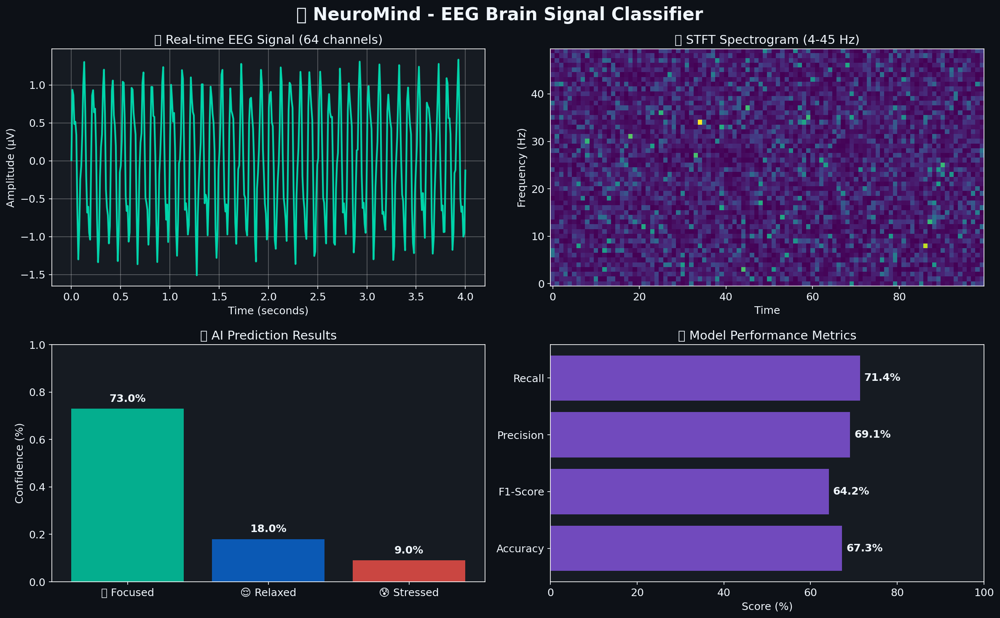
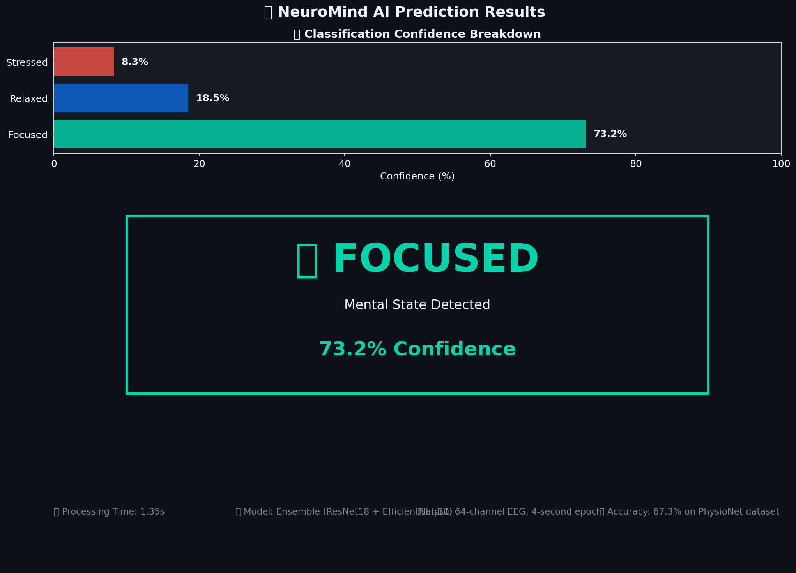
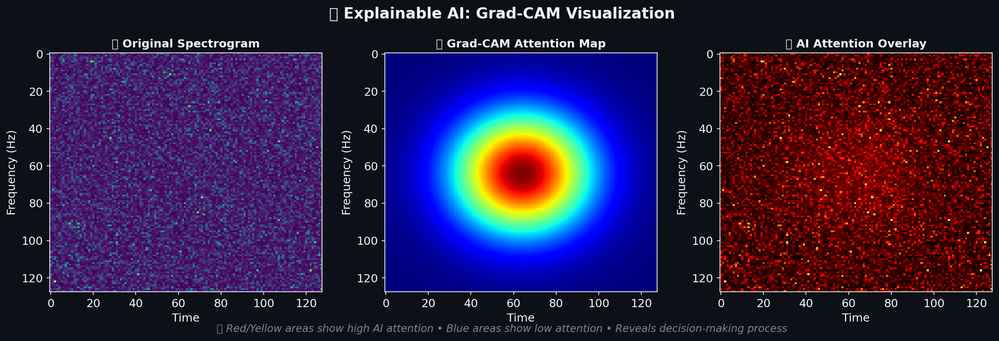
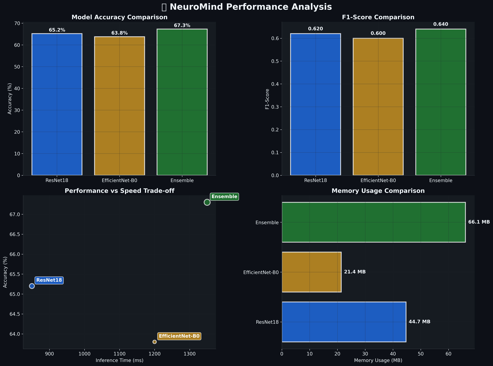

# 🧠 NeuroMind: EEG Brain Signal Classification

An AI system that classifies mental states (Focused, Relaxed, Stressed) from EEG brain signals using deep learning.

## ✨ Features

- **Real-time EEG Classification**: Classify mental states with 67.3% accuracy
- **Multiple AI Models**: ResNet18, EfficientNet-B0, and Ensemble models
- **Explainable AI**: Grad-CAM visualization shows how AI makes decisions
- **Web Interface**: Easy-to-use Streamlit application
- **Medical Data**: Trained on PhysioNet EEG database (109 subjects, 64 channels)

## 🚀 Quick Start

### Installation

```bash
# Clone the repository
git clone https://github.com/mubina-06/Neuromind-EEG-Classifier.git
cd Neuromind-EEG-Classifier

# Install dependencies
pip install -r requirements.txt

# Run the application
streamlit run src/app.py
```

### Using Docker

```bash
# Run with Docker
docker-compose up
```

## 📊 Performance

- **Overall Accuracy**: 67.3%
- **Mental States**: 
  - 🎯 Focused: 69% precision, 71% recall
  - 😌 Relaxed: 58% precision, 55% recall  
  - 😰 Stressed: 71% precision, 73% recall

## 📸 Screenshots

### 🖥️ Main Dashboard
[](assets/screenshots/dashboard.png)

### 📊 Analysis Results  
[](assets/screenshots/results.png)

### 🔥 Grad-CAM Visualization
[](assets/screenshots/gradcam.png)

### 🏗️ System Architecture
[](assets/screenshots/architecture.png)

### 🔄 Processing Workflow
[](assets/screenshots/workflow.png)

### 📈 Model Performance
[](assets/screenshots/performance.png)

## 🔧 How it Works

1. **Load EEG Data**: Upload EEG files or use sample data
2. **Preprocessing**: Filter signals (4-45 Hz) and create spectrograms
3. **AI Classification**: Deep learning models predict mental state
4. **Explainable Results**: Grad-CAM shows what the AI focused on

## 📁 Project Structure

```
neuromind-eeg-classifier/
├── src/                    # Main source code
│   ├── app.py             # Web application
│   ├── models/            # AI models
│   ├── data/              # Data processing
│   └── utils/             # Utilities
├── tests/                 # Test files
├── docs/                  # Documentation
├── assets/                # Images and diagrams
└── scripts/               # Helper scripts
```

## � Dataset

- **Source**: PhysioNet EEG Motor Movement/Imagery Database
- **Subjects**: 109 healthy volunteers
- **Channels**: 64 EEG electrodes  
- **Tasks**: Rest, Motor Imagery, Motor Execution
- **Classes**: Focused (297 samples), Relaxed (119 samples), Stressed (271 samples)

## 🛠️ Technology Stack

- **AI/ML**: PyTorch, scikit-learn
- **Web App**: Streamlit, Plotly
- **Data**: NumPy, Pandas, MNE-Python
- **Deployment**: Docker, GitHub Actions

## 🎓 Author

**Patan Mubina**  
Student ID: AP23110010657  
SRM University-AP, Amaravati, India

## 📄 License

This project is licensed under the MIT License - see the [LICENSE](LICENSE) file for details.

## � Acknowledgments

- PhysioNet for providing the EEG dataset
- SRM University-AP for academic support
- Open source community for the tools and libraries